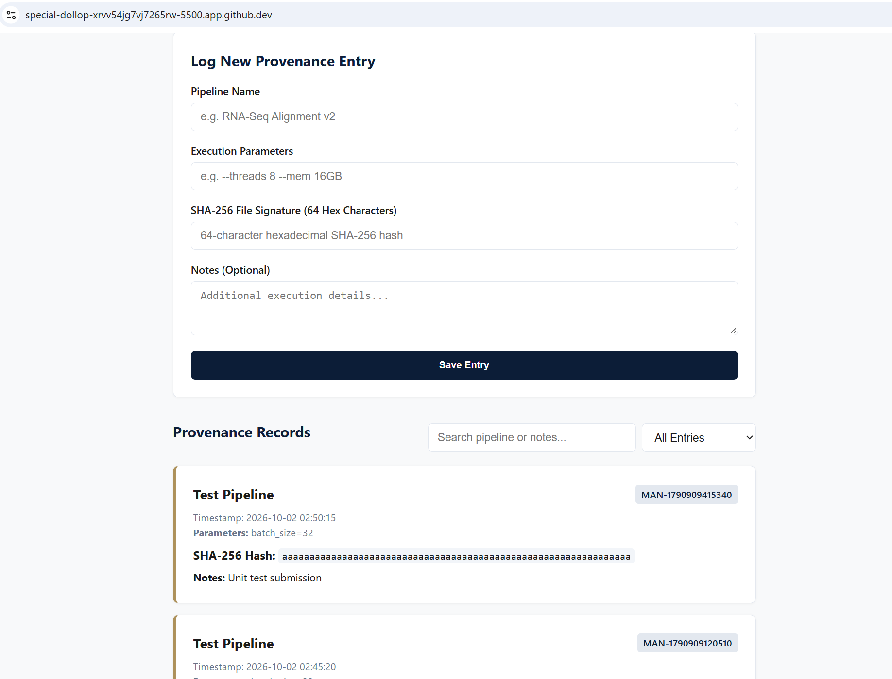

# Real-Time Search & Filter: The First Delegated Feature

> Data provenance tracking with edge backend persistence and real-time client-side search.

## What

HW4 repository: [https://github.com/Kcornett533/mgt3745-hw4](https://github.com/Kcornett533/mgt3745-hw4)

The Provenance Logger captures pipeline parameters and 64-character SHA-256 cryptographic file signatures for computational researchers and peer auditors specified in [PROJECT.md](context/PROJECT.md). This release introduces a real-time client-side search and filtering feature delegated to bolt.new as specified in [FEATURES.md](context/FEATURES.md). Provenance records now reside in a Cloudflare D1 SQLite database backed by a Cloudflare Worker API so entries survive browser cache clears and remain accessible across devices per [ADR-002](context/ARCHITECTURE.md#adr-002-entries-move-from-localstorage-to-cloudflare-d1).

## See It Work

A real-time search interface filtering records dynamically as the user types without making unnecessary network requests:



```mermaid
flowchart LR
    A[Page loads] --> B[GET /entries]
    B --> C[Render entry cards]
    D[User types search query] --> E[Filter local state array]
    E --> F[Update DOM via textContent]
    G[User submits form] --> H[POST /entries]
    H -->|201 Created| B
    H -->|400 Bad Request| I[Display UI error message]
    B -->|Network failure| I